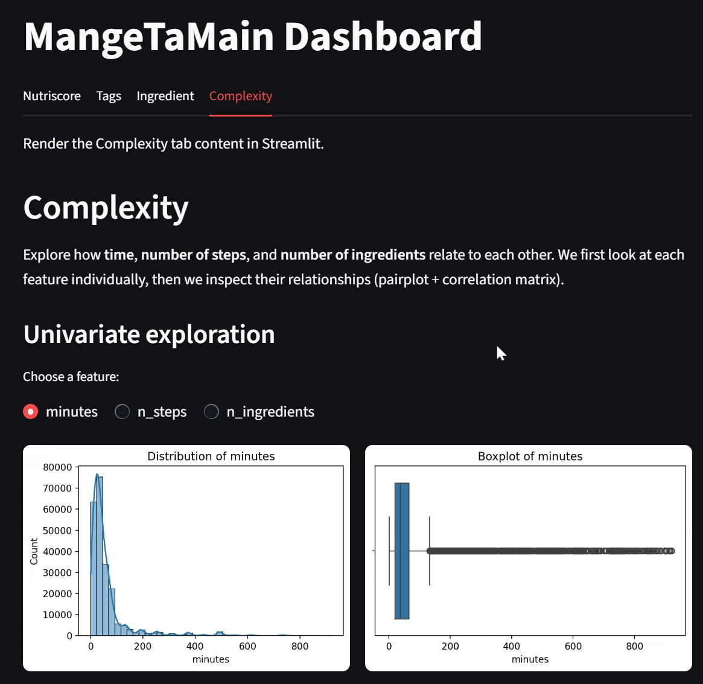

# Webapp Mangetamain

A lightweight **web application** designed for **data-driven workflows** on recipe data from [Kaggle’s Food.com dataset](https://www.kaggle.com/datasets/shuyangli94/food-com-recipes-and-user-interactions).


## 📑 Table of Contents

* [Overview](#-overview)
* [Prerequisites](#-prerequisites)
* [Installation](#-installation)
* [Project Structure](#-project-structure)
* [Development](#-development)
* [Interface](#-interface)
* [Deployment](#-deployment)
* [License](#-license)

---

## Overview

**Webapp Mangetamain** is a small, modular web application focused on recipe analysis and recommendation.
It leverages Kaggle’s *Food.com* dataset to explore ingredient relationships, co-occurrence patterns, and similarity metrics (e.g., Jaccard).

---

## 🛠️ Prerequisites

[](https://www.python.org/)

Make sure you have **Python 3.10 or higher** installed.

Optional but recommended:

* [Docker](https://www.docker.com/)
* [Hatch](https://hatch.pypa.io/) for environment and task management

---

## ⚙️ Installation

### 1. Clone the repository

```bash
git clone https://github.com/Ambroise012/webapp-mangetamain.git
cd webapp-mangetamain
```

### 2. Setup environment with Hatch

```bash
# Create development environment
hatch env create

# Enter the virtual environment
hatch shell

# Run the web application
hatch run webapp
```

### 3. (Optional) Utilities

```bash
exit                     # Leave the environment
hatch env remove default # Reset environment
hatch env create         # Recreate environment
```

---

## 📊 Data Preparation

Inside the `artifacts/` folder, create two CSV files:

* `co_occurence.csv`
* `jaccard.csv`

You can generate these files using your **ingredient data processing script** (`ingredient_data_process.py`).

---

## 📂 Project Structure

```
webapp_mangetamain/
├── data/                   # Source CSV files
├── artifacts/              # Processed artifacts (co_occurence.csv, jaccard.csv, etc.)
├── src/
│   └── webapp_mangetamain/
│       ├── __init__.py
│       └── ...
├── tests/                  # Unit tests
├── LICENSE.txt
├── README.md
├── pyproject.toml          # Hatch / Project configuration
```

### 🔍 Testing and Linting

```bash
hatch run test   # Run unit tests
hatch run lint   # Run PEP8 and code quality checks
```

---

## 🧑‍💻 Development

### Run with Docker

```bash
docker compose build --no-cache
docker compose up -d
```

Access the app at:
👉 [http://localhost:8501](http://localhost:8501)

---

## 🖥️ Interface

<p align="center">
  
</p>

## 🚀 Deployment

The app can be deployed using the provided **Dockerfile**.

* Pull directly from Docker Hub:

```bash
docker pull ambroise012/webapp_mangetamain:0.1.1
# test in local 
docker run -p 8501:8501 ambroise012/webapp_mangetamain:0.1.1
# see result : 👉 http://localhost:8501
```

---

## 📜 License

This project is distributed under the terms of the **MIT License**.
See [LICENSE.txt](./LICENSE.txt) for details.

